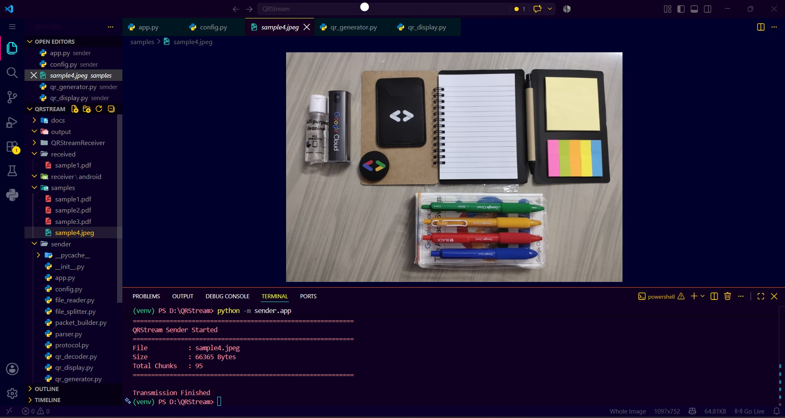
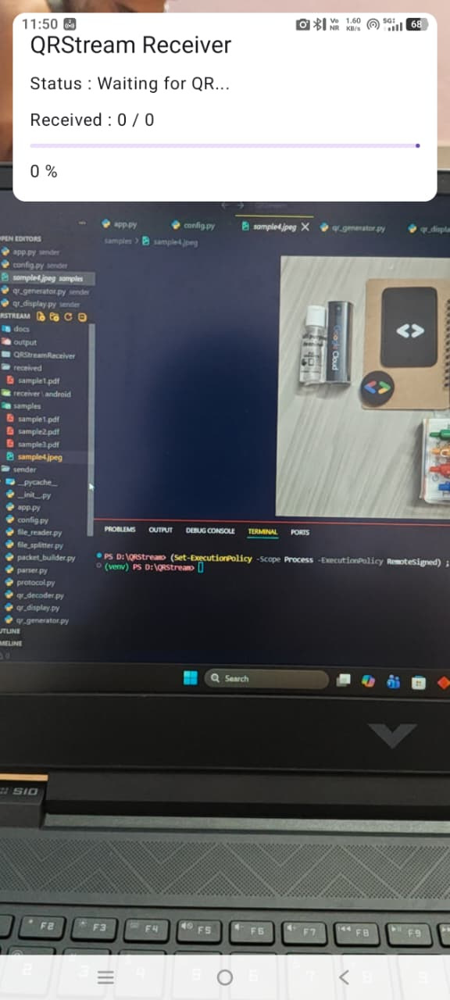
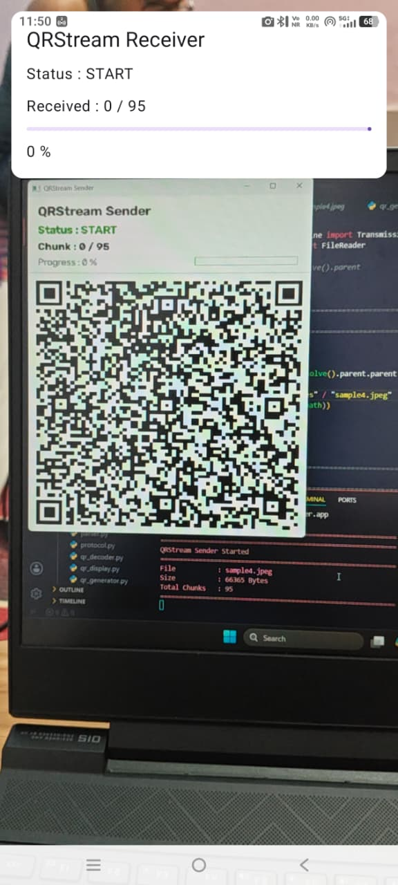
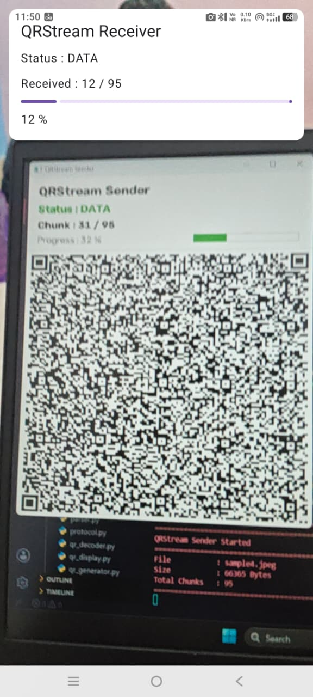
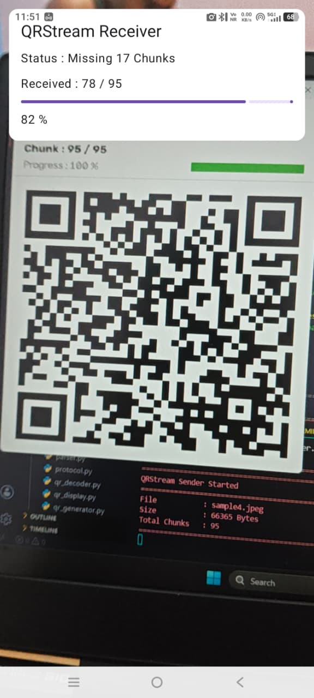
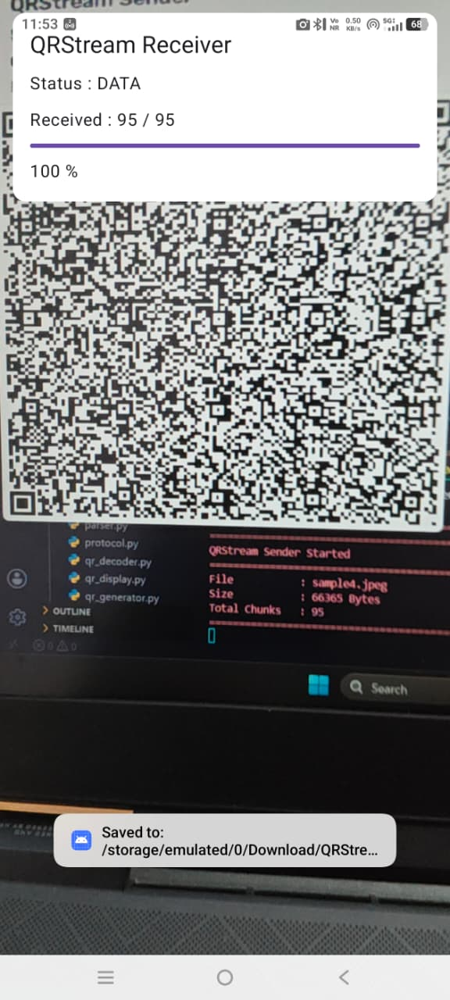
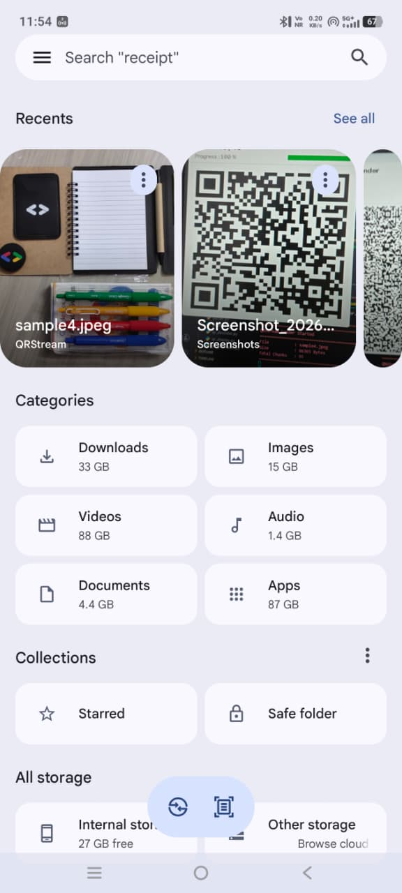

<h1 align="center">QR Stream</h1>

<p align="center">
Offline File Transfer System using Dynamic QR Codes
</p>

<p align="center">


</p>
---

## Table of Contents

- [Overview](#overview)
- [Key Features](#key-features)
- [System Architecture](#system-architecture)
- [Workflow](#workflow)
- [QRStream Protocol](#qrstream-protocol)
- [Python Sender](#python-sender)
- [Android Receiver](#android-receiver)
- [Runtime Execution](#runtime-execution)
- [Screenshots](#screenshots)
- [Performance](#performance)
- [Installation](#installation)
- [Project Structure](#project-structure)
- [Technologies Used](#technologies-used)
- [Author](#author)
- [Acknowledgements](#acknowledgements)
- [License](#license)

---

# Overview

QRStream is an **offline cross-platform file transfer system** that transfers any file from a desktop computer to an Android device using **dynamic QR codes**.

Unlike conventional transfer methods, QRStream requires **no Internet connection, Wi-Fi, Bluetooth, USB data transfer, or cloud service**. The sender continuously displays QR codes containing encoded file packets, while the Android application scans, validates, reconstructs, and stores the original file.

---

# Key Features

- Offline File Transfer
- Dynamic QR Streaming
- Cross Platform Communication
- Python Sender
- Android Receiver
- CameraX Integration
- Google ML Kit QR Detection
- Custom Binary Protocol
- START / DATA / END Packets
- CRC32 Integrity Verification
- Base64 Packet Encoding
- Chunk-based File Transmission
- Duplicate Chunk Removal
- Ordered Reconstruction
- Metadata Transmission
- UUID Transfer Sessions
- Progress Monitoring
- Missing Chunk Detection
- Automatic File Saving
- Modular Architecture

---

# System Architecture

```text
Input File
    │
    ▼
File Reader
    │
    ▼
Chunk Splitter
    │
    ▼
Packet Builder
    │
    ▼
Serializer
    │
    ▼
Base64 Encoder
    │
    ▼
QR Generator
    │
    ▼
OpenCV Display
═══════════════════════
Android Camera
    │
    ▼
ML Kit Scanner
    │
    ▼
Packet Parser
    │
    ▼
Receiver Core
    │
    ▼
File Reconstruction
    │
    ▼
Downloads/QRStream
```

---

# Workflow

1. Read selected file.
2. Split file into fixed-size chunks.
3. Build START, DATA and END packets.
4. Serialize packet into binary.
5. Encode binary using Base64.
6. Generate QR using Segno.
7. Display QR frames through OpenCV.
8. CameraX captures QR frames.
9. ML Kit decodes QR payload.
10. PacketParser reconstructs protocol packet.
11. ReceiverCore validates CRC32 and stores unique chunks.
12. Missing chunks are detected.
13. FileWriter reconstructs and stores the original file.

---

# QRStream Protocol

```text
+----------------------------------------------------------------+
| MAGIC | VERSION | TYPE | UUID | CHUNK | TOTAL | SIZE | CRC32 |
+----------------------------------------------------------------+
|                          PAYLOAD                              |
+----------------------------------------------------------------+
```

Packet Types

- START : File metadata
- DATA : Binary file chunks
- END : Transfer completion

---

# Python Sender

The Python sender handles complete transmission.

Core responsibilities:

- Read file
- Split file
- Build packets
- Serialize protocol
- Generate QR codes
- Display QR stream
- Control transmission timing

---

# Android Receiver

The Android application continuously scans QR codes and reconstructs the transmitted file.

Core responsibilities:

- Camera capture
- QR detection
- Base64 decoding
- Packet parsing
- CRC verification
- Duplicate filtering
- Chunk reconstruction
- File saving
- Progress monitoring

---

# Runtime Execution

```text
File
 │
 ▼
Read
 │
 ▼
Split
 │
 ▼
Packet
 │
 ▼
Serialize
 │
 ▼
Base64
 │
 ▼
QR Generation
 │
 ▼
Display
══════════════════════
Android Camera
 │
 ▼
Decode
 │
 ▼
Packet Parser
 │
 ▼
Receiver Core
 │
 ▼
Reconstruct
 │
 ▼
Downloads/QRStream
```

---

# Screenshots

## Sender Interface



---

## Waiting for QR



---

## Transfer Started



---

## Receiving Data



---

## Missing Chunk Detection



---

## Transfer Completed



---

## File Saved



---

# Performance

| Parameter              | Value                  |
| ---------------------- | ---------------------- |
| Chunk Size             | 700 Bytes              |
| QR Encoding            | Base64                 |
| QR Generator           | Segno                  |
| Error Correction       | Medium (M)             |
| QR Detection           | Google ML Kit          |
| Camera Framework       | CameraX                |
| Integrity Verification | CRC32                  |
| Communication          | Offline                |
| File Reconstruction    | Ordered Chunk Assembly |
| Output Location        | Download/QRStream     |

---

# Installation

## Clone

```bash
git clone https://github.com/wSubham/QR_Stream.git
cd QR_Stream
```

## Python Sender

```bash
python -m venv venv
```

Windows

```bash
venv\Scripts\activate
```

Install requirements

```bash
pip install -r requirements.txt
```

Run

```bash
python -m sender.app
```

## Android Receiver

Open `receiver_android` in Android Studio.


Build the APK

Install it on your Android device

Grant Camera Permission

Start scanning QR codes

---

# Project Structure

```text
QR_Stream
│
├── assets/
│
├── docs/
│
├── output/
│
├── received/
│
├── samples/
│
├── sender/
│   ├── app.py
│   ├── config.py
│   ├── file_reader.py
│   ├── file_splitter.py
│   ├── packet_builder.py
│   ├── serializer.py
│   ├── qr_generator.py
│   ├── qr_display.py
│   ├── transmission_engine.py
│   ├── session.py
│   └── protocol.py
│
├── receiver_android/
│   ├── app/
│   ├── gradle/
│   ├── build.gradle
│   └── settings.gradle
│
├── requirements.txt
├── README.md
├── LICENSE
└── .gitignore
```

---

# Technologies Used

Desktop

- Python
- OpenCV
- Segno
- NumPy
- Pillow

Android

- Kotlin
- Jetpack Compose
- CameraX
- Google ML Kit

Protocol

- Base64
- CRC32
- UUID
- Binary Serialization

---

# Author

**Subham Das**

---

# Acknowledgements

This project makes use of the following open-source technologies and libraries:

- OpenCV
- Google ML Kit
- CameraX
- Jetpack Compose
- Segno
- NumPy
- Pillow

Their excellent work made the development of QRStream possible.

---

# License

This project is released under the MIT License.
